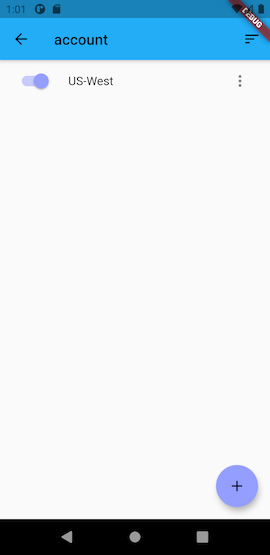
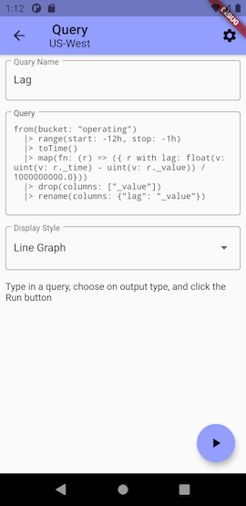
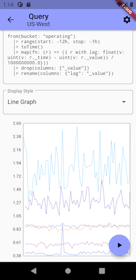
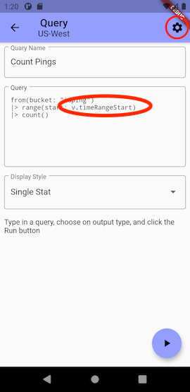
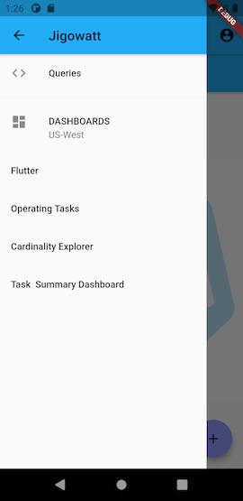

# jigowatt

A 100% community Open Source client for InfluxDB 2.0. 

Currently, Jigowatt's features focus on viewing an account, including writing queries and viewing dashboards.

Jigowatt is powered by the Open Source toolkit [Flux Mobile](https://gitlab.com/rickspencer3/flux-mobile).

Currently, there are [builds](binaries) available for Android. Theoretically, builds for IOs should easy to make, but the maintainer doesn't have any IOs devices for testing/building.

## Getting Started
### Add an Account
Start by clicking the "Account" button in the top left. 

This will bring you to your account list, which is empty. Click the "+" at the bottom to add your first account. Fill it in as below:

| Field | Notes |
|---|---|
| active? | If this is the first account you added, set it to active here. Otherwise, leave it off. |
| Org Id | This is the random alpha numeric string of your org, not the name of your org in InfluxDB. |
| URL | The URL where your account can be reached, including the trailed "/." For example: "https://us-west-2-1.aws.cloud2.influxdata.com/". This should work fine pointed to your own running Open Source instance of InfluxDB 2.0 as well. |
| Token | This is an all access Token for your account so you can see all dashboards, and query all buckets. |

After creating your account, it should appear as active in the list. You can delete, edit, and add accounts here in the future.

Clicking the back button will take you to the main Query Screen, where you can add and delete queries.

#### Finding your Org Id
Log into InfluxDB in your browser, and in the upper left, you can access user info. Your Org Id is there ready to be copied.

#### Getting a Token
1. In your browser, go to your data tab, and click on tokens.

2. Drop down the "Generate" dropdown, and choose "All Access Token." Name the token as you wish.
3. Click on the token in the token list to get access to your token

### Writing a Query
To write a query, click on the "+" button on the Query screen, and it will bring up the query editor/runner. The name of the current active account is displayed in the header.

#### Name your query
If you think you will be keeping this query, it's a good idea to give it a name. Don't worry, you can always edit the name later.

#### Enter your query
You can type your query into the large editor labeled "Query." Currently, this is a simple text editor, so, no help writing your query yet. Click the Run button to run your query.

Queries are automatically saved when you created and edit them. You can delete them by swiping them to the right.

#### Choose a Display Style
Depending on the data you are displaying. Currently there are 3 visualizations available.

| Line Graph | Table | Single Stat |
| --- | --- | --- |
|  |  |  |

#### Set Platform Variables
Platform Variables (variables that start with "v." in your Flux) can be set using the gear icon at the top of the Query page. 

These variables are defined in your InfluxDB account but can be displayed and set in Jigowatt. "timeRangeStart" being the most common one to set. 

Hitting the OK button will set the variables as chosen, but will not re-run the query. You can click the Play button again for that.

### Viewing Dashboards
The drawer icon ("hamburger menu") gives you access to overall app navigation. 

This allows you to select returning to the Query list, or you can select from a list of dashboards for your currently active account. 

Dashboards are defined in your InfluxDB Account. Note that the real web app for InfluxDB dashboards is much much much more powerful than what Jigowatt tries to provide. For example, Jigowatt can only display 4 dashboard cell types (the three mentioned above, plus markdown). 

Platform Variables can be set in the same way as described above for queries. However, dashboards will automatically refresh after interacting with the variables form. Additionally, you can refresh the dashboard by pulling down on it.

# Roadmap
Features under considertion:
 * Ability to view buckets, and to get details such as cardinality, last written, etc... from a specific bucket.
 * Ability to view tasks, and to get details on each task, such as last run, failures, etc...
 * Query builder, especially injecting common from() |> range() clauses, aggregation, etc...
 * More visualization types.
 * Ability to modify an account, such as create and delete buckets, start and stop tasks, edit task metadata, etc...
 * Write tests and set up CI
 * IOs builds

# Bugs and Feature Requests
If you have feature requests or have encountered bugs, please log an issue in the [issue tracker for the project](https://gitlab.com/rickspencer3/jigowatt/-/issues). Please keep in mind that this is a completely community open source project, so, pull requests are welcome.

